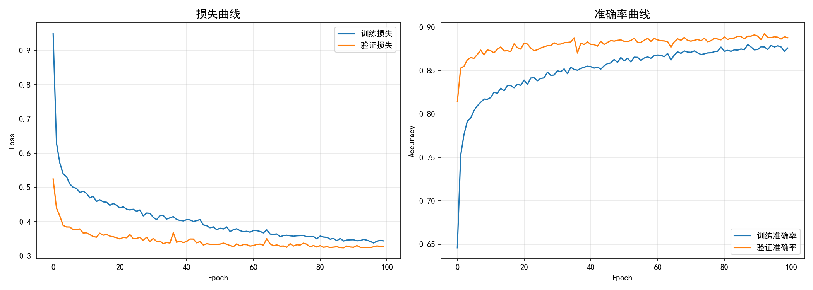
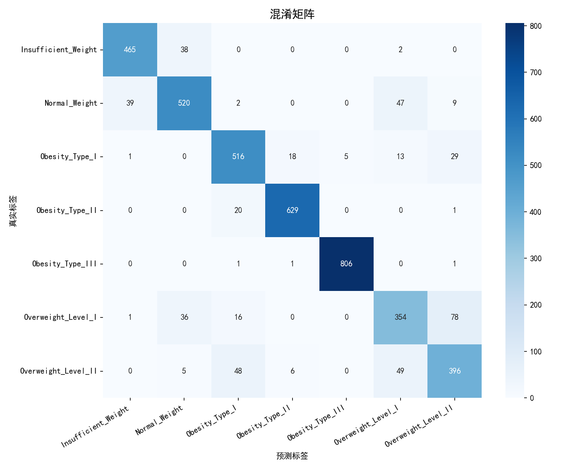

# 肥胖风险分类 - 模型训练报告

> 自动生成于 2026-05-06 20:34:05

---

## 1. 项目概述

本项目基于深度学习技术，利用多层全连接神经网络（MLP）对个体肥胖风险进行 7 级分类评估。
输入特征包括个人基本信息、饮食习惯、运动频率等 16 个维度，输出为 7 个肥胖等级。

## 2. 实验环境

| 项目 | 配置 |
|------|------|
| 设备 | NVIDIA GeForce RTX 3050 Ti Laptop GPU |
| PyTorch 版本 | 2.5.1+cu121 |
| Python 版本 | 3.11.15 |
| 操作系统 | Windows 10 |

## 3. 数据集信息

- **总样本数**: 20758
- **训练集**: 16606 条
- **测试集**: 4152 条
- **特征维度**: 16
- **分类类别数**: 7

### 类别标签

| 编码 | 类别名称 | 中文含义 |
|------|----------|----------|
| 0 | `Insufficient_Weight` | 体重不足 |
| 1 | `Normal_Weight` | 正常体重 |
| 2 | `Obesity_Type_I` | 肥胖类型 I |
| 3 | `Obesity_Type_II` | 肥胖类型 II |
| 4 | `Obesity_Type_III` | 肥胖类型 III |
| 5 | `Overweight_Level_I` | 一级超重 |
| 6 | `Overweight_Level_II` | 二级超重 |

## 4. 模型架构

采用多层全连接神经网络（MLP），配合 BatchNorm 和 Dropout 进行正则化：

```
输入层(16) → FC(128) → BN → ReLU → Dropout(0.3)
           → FC(256) → BN → ReLU → Dropout(0.3)
           → FC(128) → BN → ReLU → Dropout(0.2)
           → FC(64)  → BN → ReLU → Dropout(0.2)
           → 输出层(7)
```

- **总参数量**: 77,959
- **可训练参数**: 77,959

## 5. 训练配置

| 参数 | 值 |
|------|-----|
| Epochs | 100 |
| 学习率 | 0.001 |
| Batch Size | 64 |
| 优化器 | Adam (weight_decay=1e-4) |
| 学习率调度 | ReduceLROnPlateau (factor=0.5, patience=10) |
| 损失函数 | CrossEntropyLoss |
| 最佳 Epoch | 93 |
| 最佳验证准确率 | 0.8926 |

## 6. 训练曲线



- 最终训练损失: 0.3439
- 最终验证损失: 0.3284
- 最终训练准确率: 0.8759
- 最终验证准确率: 0.8878

## 7. 评估结果

### 总体指标

- **总体准确率 (Accuracy)**: 0.8878 (88.78%)
- **宏平均精确率 (Macro Precision)**: 0.8757
- **宏平均召回率 (Macro Recall)**: 0.8757
- **宏平均 F1 分数 (Macro F1)**: 0.8756

### 各类别详细指标

| 类别 | Precision | Recall | F1-Score | 准确率 | 样本数 |
|------|-----------|--------|----------|--------|--------|
| 体重不足 | 0.9190 | 0.9208 | 0.9199 | 0.9208 | 505 |
| 正常体重 | 0.8681 | 0.8428 | 0.8553 | 0.8428 | 617 |
| 肥胖类型 I | 0.8557 | 0.8866 | 0.8709 | 0.8866 | 582 |
| 肥胖类型 II | 0.9618 | 0.9677 | 0.9647 | 0.9677 | 650 |
| 肥胖类型 III | 0.9938 | 0.9963 | 0.9951 | 0.9963 | 809 |
| 一级超重 | 0.7613 | 0.7299 | 0.7453 | 0.7299 | 485 |
| 二级超重 | 0.7704 | 0.7857 | 0.7780 | 0.7857 | 504 |
| **加权平均** | **0.8874** | **0.8878** | **0.8875** | **0.8878** | **4152** |

### 混淆矩阵



## 8. 结果分析

### 性能表现

- **表现最佳类别**: 肥胖类型 III，准确率 0.9963，F1 = 0.9951
- **表现最差类别**: 一级超重，准确率 0.7299，F1 = 0.7453

### 结论

模型在测试集上取得了 **88.78%** 的总体准确率，
宏平均 F1 分数为 **0.8756**。

从混淆矩阵可以看出：
1. Obesity_Type_III（肥胖类型 III）识别效果最好，F1 达到 0.9951，这可能因为该类别的特征最为显著。
2. Overweight_Level_I（一级超重）和 Overweight_Level_II（二级超重）的分类难度相对较大，F1 分数分别为 0.7453 和 0.7780，可能因为相邻等级之间的特征差异较小。
3. 模型在 93 个 epoch 后达到最佳验证性能，之后未出现明显过拟合，说明 Dropout 和 BatchNorm 的正则化效果良好。

## 9. 输出文件

| 文件 | 说明 |
|------|------|
| `report.md` | 模型训练报告（含分类报告） |
| `training_curves.png` | 训练和验证的损失/准确率曲线 |
| `confusion_matrix.png` | 混淆矩阵热力图 |
| `best_model.pth` | 最佳模型权重 |
| `processed_data.npz` | 预处理后的数据集 |
| `label_distribution.png` | 标签分布图 |
| `feature_distributions.png` | 数值特征分布图 |
| `correlation_heatmap.png` | 特征相关性热力图 |

---

*本报告由模型训练流程自动生成。*